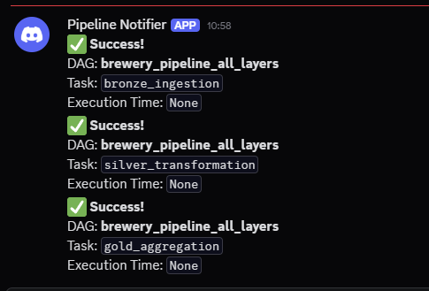

# 🍺 Brewery Data Pipeline

This project demonstrates a data pipeline that extracts data from the [Open Brewery DB API](https://www.openbrewerydb.org/), processes it following the **Medallion Architecture** (bronze → silver → gold), and orchestrates it using **Apache Airflow**.

The solution is containerized with Docker and includes unit tests, monitoring strategy, and modular design.

## 📐 Architecture Overview

```
Open Brewery DB API
        |
     (Bronze)
  ────────────────
  Raw JSON data persisted
        |
     (Silver)
  ────────────────
  Transformed Parquet data
  Partitioned by state
        |
     (Gold)
  ────────────────
  Aggregated data (brewery count per type and state)
```

## 🧰 Tech Stack

| Layer        | Technology      |
|--------------|-----------------|
| Orchestration | Apache Airflow |
| Language      | Python          |
| Processing    | Pandas (local) / PySpark (scalable) |
| Storage       | Local File System (Data Lake simulation) |
| Containerization | Docker + Docker Compose |
| Testing       | Pytest         |

## 🧪 Pipeline DAGs

You can run the process in two ways:

### 1. Full Pipeline DAG
`brewery_pipeline_all_layers.py`: orchestrates Bronze → Silver → Gold in sequence.

### 2. Modular DAGs
- `bronze/ingest_breweries.py`: fetch and persist raw data
- `silver/transform_breweries.py`: clean, convert to Parquet, partition by location
- `gold/aggregate_breweries.py`: aggregate brewery counts per type/state

## 🚀 Getting Started

### 1. Clone the Repository

```bash
git clone https://github.com/gkenjiw/brewery_pipeline.git
cd brewery_pipeline
```

### 2. Start Airflow via Docker

```bash
make init     # Initialize Airflow DB
make up       # Build and start containers
```

Airflow UI will be available at [http://localhost:8080](http://localhost:8080)

### 3. Configure Discord Webhook

In `dags/common/notifiers.py:37` and `dags/common/notifiers.py:59`, you need to change the `WEB_HOOK_URL` to configure the Discord Bot.
(You can use your own server and webhook, but a test server should be provided in private)

### 4. Run the Pipeline

Enable and trigger either the full DAG or the modular ones from the Airflow UI.

## 📈 Monitoring & Alerting

For monitoring and alerting uses Airflow’s native logging, retry, and SLA features, and it's using Discord Webhook integration to notify success and failure at the tasks.



For security measures, link to Discord server and it's webhook should be provided in private.

In a production setup, you should extend this with:

- Slack or Email alerts on task failure (methods are in notifiers.py in `dags\common`, just need to configure)
- Data quality checks (e.g., null fields, record counts)
- Metrics with Prometheus/Grafana
- Integration with external observability tools like Datadog

## 🗃️ Data Lake Layout (Local)

```
./data/
├── bronze/   # Raw JSON files
├── silver/   # Parquet files partitioned by state
└── gold/     # Aggregated CSV/parquet outputs
```

## ⚙️ Project Structure

```
brewery_pipeline/
├── dags/
│   ├── bronze/
│   ├── silver/
│   ├── gold/
│   ├── common/        # Reusable code (API, transforms)
│   └── brewery_pipeline_all_layers.py
├── data/
├── docker/
│   └── airflow/
│       ├── Dockerfile
│       └── requirements.txt
├── tests/
├── docker-compose.yml
├── Makefile
└── README.md
```

## 💡 Design Considerations

- The project favors clarity and simplicity for local testing.
- Data is processed with Pandas for local runs; in production, PySpark is recommended.
- Paths use container-mounted volumes (`/opt/airflow/data`).
- Functions are isolated for testability and reuse across DAGs.

## 🌐 Cloud Instructions (if applicable)

This project is designed for local execution. If deployed to the cloud:

- Replace local volumes with S3, GCS, or Azure Blob
- Use managed Airflow (e.g., MWAA, Cloud Composer, Astro)
- Use Delta Lake and Spark for large-scale transformations
